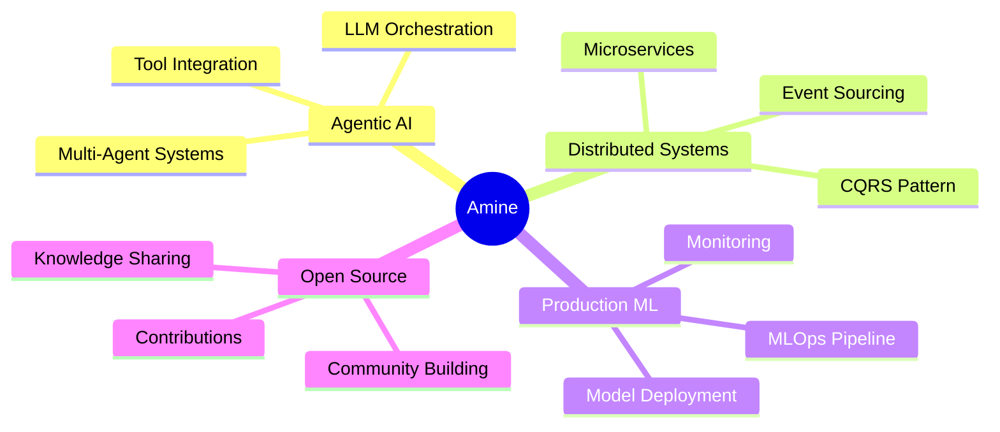

<div align="center">

# 🚀 AMINE HAMDI

### `Full-Stack Developer` | `AI Engineer` | `System Architect`


[](https://aminehamdi-hub.github.io/portfolio/)
[](https://www.linkedin.com/in/amine-elhamdi/)
[](https://github.com/AmineHamdi-hub)
[](mailto:amine.hamdi@enis.tn)


</div>

## 💫 About Me

```yaml
name: Amine Hamdi
located_in: Sfax, Tunisia 🇹🇳
education: Computer Science Engineer @ ENIS
interests: [Agentic AI, Distributed Systems, Real-Time Processing]
currently_learning: [Advanced RAG Systems, Spring Cloud, LLM Fine-tuning]
2025_goals: 
  - Build production-grade AI agents
  - Contribute to major open source projects
  - Master distributed system patterns
fun_fact: "I turn coffee into AI-powered solutions ☕ → 🤖"
```


## 🎯 What I Do

<table>
<tr>
<td width="50%">

### 🤖 AI & Machine Learning
```python
expertise = {
    "Computer Vision": ["YOLOv8", "Real-time Detection"],
    "NLP & LLMs": ["RAG Systems", "LangChain", "Grok"],
    "Medical AI": ["Diagnostic Support", "Image Processing"],
    "Vector DBs": ["PostgreSQL pgvector", "Embeddings"]
}
```

</td>
<td width="50%">

### 🏗️ Backend & Architecture
```java
@Architecture
class MyExpertise {
    Microservices: Spring Boot + Cloud
    APIs: FastAPI, Django, Spring
    Patterns: Event-Driven, CQRS
    Discovery: Eureka, API Gateway
    Config: Spring Cloud Config
}
```

</td>
</tr>

<tr>
<td width="50%">

### 🎨 Frontend & Mobile
```typescript
const skills = {
  web: ["Next.js", "React", "Streamlit"],
  mobile: ["Flutter"],
  styling: ["Tailwind", "Material UI"],
  state: ["Redux", "Context API"]
}
```

</td>
<td width="50%">

### 🔧 DevOps & Tools
```bash
# Daily toolkit
docker compose up -d
git commit -m "feat: new AI feature"
kubectl apply -f deployment.yaml
psql -d vector_db
```

</td>
</tr>
</table>


## 💼 Professional Journey

<details open>
<summary><b>🦅 FullStack/AI Intern @ EagleProjects Tunisia</b></summary>
<br>

**Jun 2025 – Aug 2025** | *Remote*

```diff
+ Built Real-Time Object Detection Dashboard with YOLOv8
+ Architected FastAPI backend handling 1000+ concurrent requests
+ Developed Next.js frontend with real-time WebSocket updates
+ Deployed complete AI pipeline from training to production
```

**Tech Stack:** `Python` `FastAPI` `YOLOv8` `Next.js` `WebSockets` `Docker`

</details>

<details>
<summary><b>🏥 Developer Intern @ REGIM Lab</b></summary>
<br>

**Jun 2024 – Aug 2024** | *Remote*

```diff
+ Created hospital management app for Nephrology Service
+ Implemented secure Firebase authentication & real-time DB
+ Built Django backend for medical image processing
+ Streamlined patient data management workflow
```

**Tech Stack:** `Flutter` `Firebase` `Django` `Medical Imaging` `REST APIs`

</details>


## 🚀 Featured Projects

<div align="center">

<table>
<tr>
<td width="50%" valign="top">

### 🏥 RAG Medical Chatbot
*AI-Powered Healthcare Assistant*

[](YOUR_REPO_LINK)


**Highlights:**
- 🧠 Grok LLM integration
- 📚 Vector DB knowledge base
- 🎨 Streamlit interface
- 🔍 Context-aware responses

**Stack:** Python • LangChain • PostgreSQL • Streamlit

</td>
<td width="50%" valign="top">

### 🏗️ Microservices Ecosystem
*Enterprise-Grade Distributed System*

[](YOUR_REPO_LINK)


**Highlights:**
- 🌐 4 independent services
- 🔄 Eureka service discovery
- ⚙️ Centralized config server
- 🚪 API Gateway routing

**Stack:** Spring Boot • Spring Cloud • Eureka • Docker

</td>
</tr>

<tr>
<td width="50%" valign="top">

### 🛒 E-Commerce Platform
*Full-Featured Online Store*

[](YOUR_REPO_LINK)


**Highlights:**
- 🛍️ Complete shopping flow
- 💳 Payment integration
- 👤 User management
- 📦 Order tracking

**Stack:** PHP • MySQL • Bootstrap • jQuery

</td>
<td width="50%" valign="top">

### 📱 Hospital Management App
*Healthcare Data Solution*

[](YOUR_REPO_LINK)


**Highlights:**
- 📊 Patient data management
- 🔐 Secure authentication
- 🖼️ Medical image processing
- 📱 Cross-platform mobile

**Stack:** Flutter • Firebase • Django • REST API

</td>
</tr>
</table>

</div>


## 🛠️ Technology Arsenal

<div align="center">

### Languages


### Backend & Frameworks


### Frontend & Mobile


### AI/ML & Data


### Databases & Tools


</div>


## 📊 GitHub Analytics

<div align="center">
  
<a href="https://github.com/AmineHamdi-hub">
  
  
</a>

</div>

<div align="center">
  
</div>

<div align="center">
  
</div>

<div align="center">
  
[](https://github.com/AmineHamdi-hub)

</div>


## 🏆 Certifications & Achievements

<div align="center">

| Certification | Organization | Date | Focus Area |
|--------------|--------------|------|------------|
| 🎯 **Project Management Fundamentals** | IBM | Dec 2025 | Agile, Stakeholder Management |
| 🌐 **DevNet Associate** | Cisco | Dec 2025 | Software Dev & Automation |
| 🤖 **Intro to LangChain** | - | 2025 | LLM Application Development |

</div>


## 🌍 Languages

<div align="center">

```javascript
const languages = {
    arabic: "████████████████████ 100% (Native)",
    english: "████████████████░░░░  85% (Advanced)",
    french: "████████████░░░░░░░░  60% (Intermediate)"
};
```

</div>


## 📈 Current Focus

<div align="center">



</div>


## 📞 Let's Connect!

<div align="center">

### 💬 *"Building intelligent systems, one commit at a time"*

[](https://aminehamdi-hub.github.io/portfolio/)
[](https://www.linkedin.com/in/amine-elhamdi/)
[](mailto:amine.hamdi@enis.tn)
[](tel:+21694963330)

<br>


<br>

### ⭐ *From Tunisia with Code* 🇹🇳


</div>
